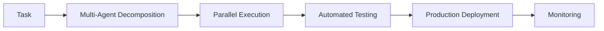

<div align="center">
  
</div>

<h1 align="center">Hi there, I'm Eli6! 👋</h1>

<div align="center">
  
</div>

<br/>

<h2 align="center">About Me 🚀</h2>

<p align="center">I'm a developer who builds production-ready systems using AI-driven workflows and multi-agent collaboration. I specialize in automation tools, community bots, and AI-assisted development that accelerates coding by 10x while maintaining 95%+ test coverage.</p>

<h2 align="center">Featured Projects 🎯</h2>

<div align="center">

| Project | Description | Tech Stack |
|---------|-------------|------------|
| 🖥️ **Android TV Tools** | Cross-distribution device management system | Python, ADB, pytest |
| 💬 **WhatsApp Bot** | Multi-agent bot with 109+ commands, 7 languages | Node.js, Baileys, SQLite |
| 🔒 **HackerAI** | AI-powered penetration testing assistant | Next.js, E2B, Convex |
| 🎮 **203658.xyz** | XQR Cartridge encryption toolkit | JavaScript, Crypto |
| 🌤️ **VR_Meteo** | Weather dashboard with 7-day forecasts | Vanilla JS, APIs |

</div>

<h2 align="center">Tech Stack 💻</h2>

<div align="center">
  
</div>

<h2 align="center">AI Development Tools 🤖</h2>

<div align="center">
  
  
  
  
  
  
</div>

<h2 align="center">Development Metrics 📊</h2>

<div align="center">

```
🔥 10,000+ lines of AI-generated code
⚡ 10x development speed acceleration  
✅ 95%+ automated test coverage
🤖 ~3M+ tokens consumed in development
📦 26 public repositories
🌍 7 languages supported (WhatsApp Bot)
💬 1000+ messages/day processed
```

</div>

<h2 align="center">GitHub Stats 📈</h2>

<div align="center">
  
  
</div>

<div align="center">
  
</div>

<h2 align="center">AI Workflow Architecture 🔄</h2>

<div align="center">



**Multi-Agent Collaboration** → **Long-Chain Reasoning** → **Automated Validation** → **Production Ready**

</div>

<h2 align="center">Connect with Me 🤝</h2>

<div align="center">
  
[](https://github.com/EliseyRotar)
[](https://github.com/EliseyRotar)
[](https://github.com/EliseyRotar)

</div>

<div align="center">
  
</div>

<h2 align="center">Recent Activity 🔥</h2>

<div align="center">

- 🔨 Building **Android TV Tools** with AI-assisted architecture
- 🤖 Maintaining **WhatsApp Bot** with 109+ commands
- 🚀 Contributing to **HackerAI** penetration testing platform
- 📚 Exploring multi-agent orchestration patterns
- ⚡ Accelerating development with Kiro CLI workflows

</div>

<div align="center">
  
</div>

---

<div align="center">
  <sub>🤯 Crazy work | Built with AI-driven workflows | Powered by Kiro CLI</sub>
</div>
